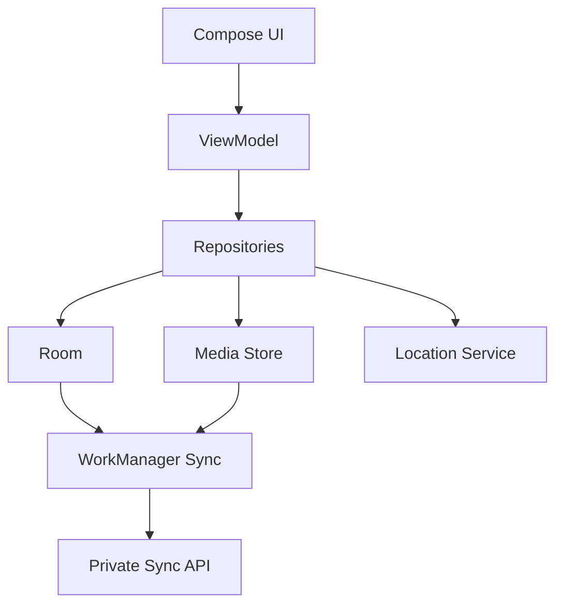
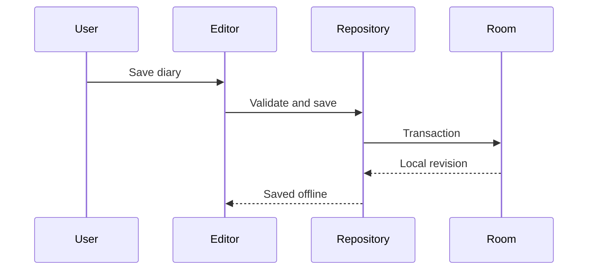

# LifeTrace 技术架构

## 1. 架构原则

1. 本地数据库是客户端的事实来源。
2. 所有写入先落本地，再由同步队列上传。
3. UI 不直接访问数据库、定位 SDK 或网络。
4. 后台定位与日记编辑相互独立，避免单点故障。
5. 加密边界位于客户端；服务器只保存密文和同步所需的最少索引。

## 2. 总体结构



## 3. Android 模块边界

首个里程碑先采用单应用模块，但源码按职责分包：

```text
com.lifetrace.app
├── core/          # 通用结果、时间、权限与调度
├── data/          # Room、文件与 Repository 实现
├── domain/        # 业务模型与用例
├── feature/
│   ├── diary/     # 时间线、编辑与详情
│   ├── map/       # 地图与轨迹
│   └── settings/  # 定位、同步和隐私设置
├── location/      # 前台定位服务与轨迹过滤
├── sync/          # 加密、上传和冲突处理
└── ui/            # 主题与导航
```

当编译时间或团队规模需要时，再拆分为 Gradle 多模块；首版不提前承担多模块复杂度。

## 4. 本地数据流



日记正文、媒体引用和同步记录必须在一个逻辑事务中更新。图片先复制到应用私有目录，数据库只保存受控路径和元数据。

## 5. 轨迹采集

- Android Foreground Service 保证用户可感知的持续定位
- Fused Location Provider 提供位置样本
- 动态采样器根据活动状态、位移、精度和时间决定保存
- 原始点先本地持久化，再异步简化用于地图渲染
- 原始数据不因地图抽稀而丢失

建议初始策略（需真机测试校准）：

| 状态 | 采样建议 | 保存条件示例 |
|---|---|---|
| 静止 | 5～15 分钟 | 明显位移或定时心跳 |
| 步行 | 30～90 秒 | 位移 20～50 米 |
| 驾车 | 10～30 秒 | 位移 50～150 米 |

## 6. 同步与冲突

- 每条记录使用 UUID 和单调递增本地 revision
- 删除采用 tombstone，避免其他设备重新拉回
- WorkManager 在网络可用时批量上传
- 原图默认要求非计费网络，文本与缩略图可使用普通网络
- 首版多设备冲突采用最后修改时间加设备 ID 的确定性规则
- 服务端不得成为本地编辑的前置依赖

## 7. 安全设计

- Android Keystore 保存设备密钥包装密钥
- 数据密钥与恢复密钥分离
- 每个对象使用独立随机 nonce
- 采用带认证的加密算法，具体算法在实现前通过 ADR 固定
- 服务端仅持有密文、对象 ID、版本和必要的同步状态
- 崩溃日志和诊断包在上传前移除精确位置与用户内容

## 8. 服务端边界

服务端计划采用 FastAPI、PostgreSQL 和对象存储。首个里程碑仅保留目录与接口契约，不部署服务，避免在客户端数据模型稳定前固化 API。
